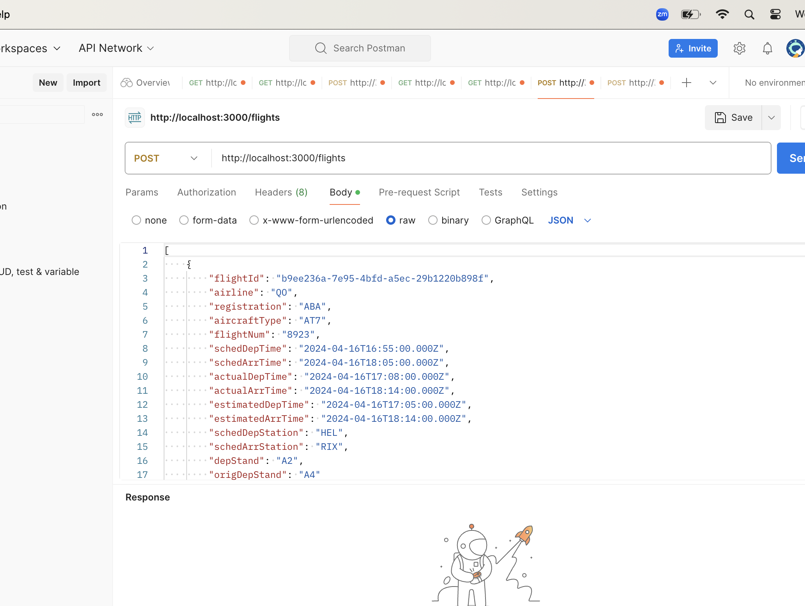

## Frontend
- node version - v21.7.2

# React + TypeScript + Vite

## Below command are used to create new react projects
- npm create vite
- React
- Typescript

## To run React application
- cd Frontend/airCaftMaintaince
- npm i
- npm run build
- npm run dev

########################################################

## Backend

## Technology stack
- express
- node
- Typescript
- sequelize/sqlite

## To run server, use below command:
- cd Backend/aircaftServer
- npm i
- npm start dev
- open in browser localhost://3000/

## Note: To insert data in dev.sqlite database, below steps are used:
- Install postman
-
    # Enter url: http://localhost:3000/flights
    # Select method: Post
    # Selct body-> raw -> copy flights.json data 
    # click send button
    # Data will get inserted into [dev.sqlite] db

- 

